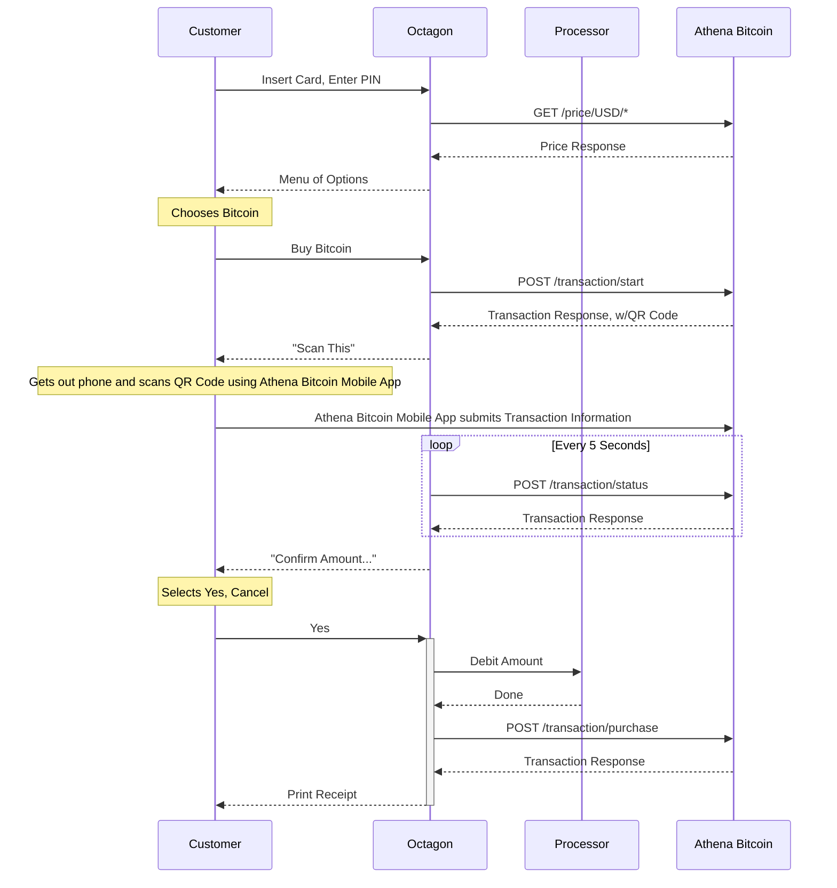
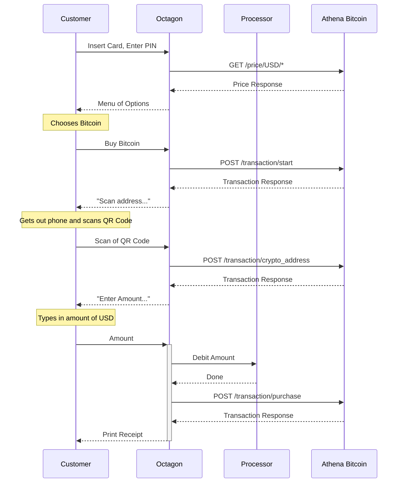

## General machine specifications

The machine __WILL__ have:

- Screen (not touch)
- 8 buttons (4-each side of screen)
- Card reader (magnetic and chip)
- PIN pad
- Cash Dispenser
- Printer

The machine __WILL NOT__ have:

- Touch screen
- QR Code reader
- Cash Acceptor

# Process Flow

## For a machine without a QR Code Scanner:

# For a machine with a QR Code Scanner (ATM reads phone):

## 