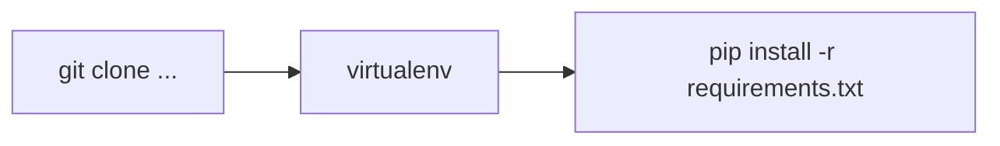
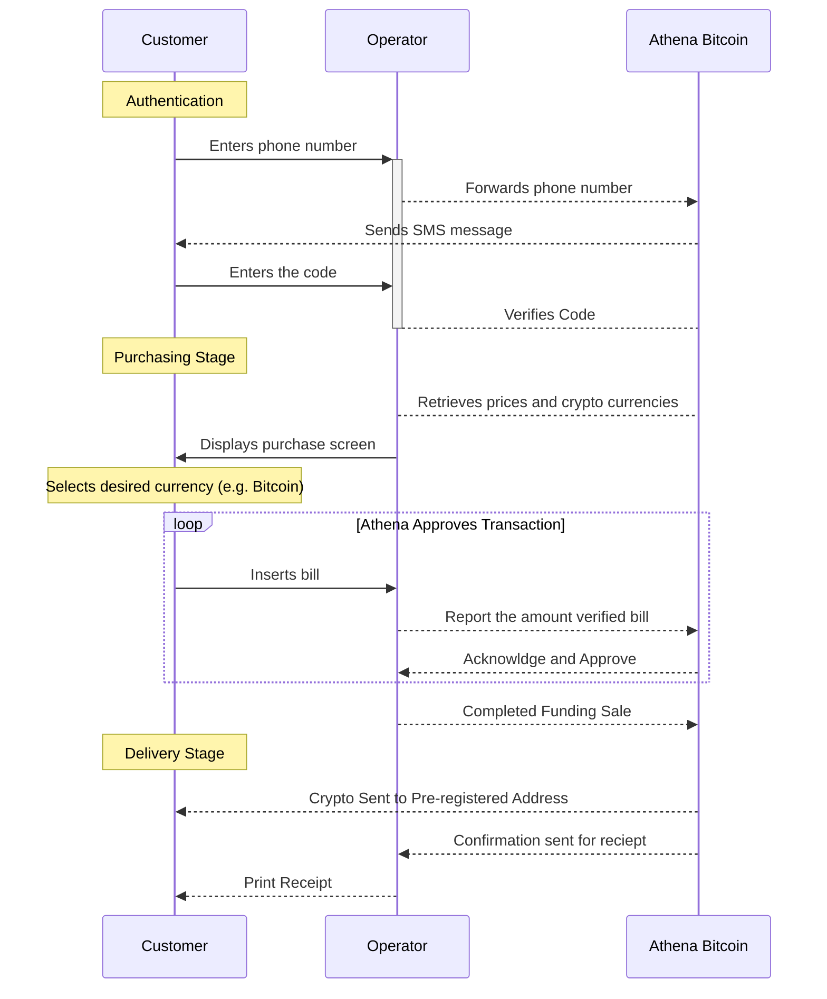
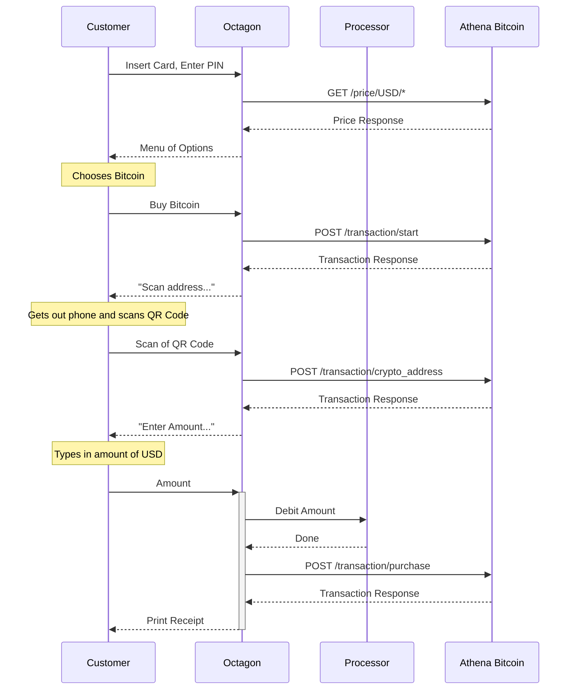

# Digital Asset Vending through traditional ATM Hardware

## Overview

This project offers a solution for owners and operators of traditional ATM machines to partner with Athena Bitcoin, Inc. in order to offer their customers an opportunity to purchase digital assets, including - but not limited to - the cryptocurrency bitcoin.

The use case is for a **customer** to visit an ATM that has been integrated with the Athena Solution described in this document.  Depending on the integration, the customer will be permitted to purchase crypto currency using fiat currency or a bank issued debit card from **Athena Bitcoin**.  The payment, either physical cash or bank deposit, will be deposited into the custody of the ATM operator.  At a regular intervals Athena and the ATM operator will review the activity and the payment - less the agreed upon amount the operator is entitled to - will be remitted to Athena. 

The ATM may or may not have a scanner capable of reading a Bitcoin address from a QR Code. The workflow is slightly different where the machine cannot read a QR Code; the user must use the Athena Bitcoin Mobile App to enter the address where he or she wishes the crypto currency to be delivered.

# Dev Process

### Prep

You need to git the code, install the requirements & get set with a virtual environment



### The Manual Way ###

After retrieving the code, you'll need to perform several steps if you want to interact with _aws cloudformation_ directly. 

(the following commands are all contained with the following: 
```shell
python .\deploy.py --profile=dirtydev
```

1. You'll need to install the requirements for every one of the lambdas.  That involves running a command similar to the following
​```shell
 pip install .\files\services\lambdas\about\requirements.txt -t .\files\services\lambdas\about\
```

2. After having prepped the directories for a deployment, you'll need to _pacakage_ the project.  You can use the following when deploying to the **dirtydev** environment
​```shell
aws cloudformation package --template-file template.yaml --profile dirtydev --debug --s3-bucket athena-build-archive-test --output-template-file packaged-dirtydev.yaml
```

3. Finally, you'll want to _deploy_ to the environment.  If you have jq working you can do a fancy command like: 
```shell
aws cloudformation deploy --template-file packaged.yaml --stack-name dev-checkout-api --capabilities CAPABILITY_IAM --role-arn {CFNRoleArn} --region us-east-1 --parameter-overrides $(jq -rj '.Parameters|to_entries[]|"\(.key)=\(.value) " ' dev.json)
```
[Thanks Saravanan!](https://teams.microsoft.com/l/message/19:7be4f2a1e8a34dec87e0128997ec01c2@thread.skype/1547576719098?tenantId=d499179e-08d2-4ee3-aa09-cad38ff557c5&groupId=c8b0d8a8-0d18-49ff-9304-84b6f75c466c&parentMessageId=1547576719098&teamName=Technology&channelName=Devops&createdTime=1547576719098)

**Alternatively** you can specify the params locally (The only way I've been able to get it to work on windows)... something similar to 

```shell
type dev.json

aws cloudformation deploy --template-file packaged-dirtydev.yaml --stack-name dev-checkout-api --capabilities CAPABILITY_IAM --role-arn arn:aws:iam::053575238526:role/cloudformationdeployer-role --profile dirtydev --parameter-overrides targetStage=dev paramStoreLayer=arn:aws:lambda:us-west-2:647677418029:layer:ProdPythonParamStore:2  airbrakeLoggingLayer=arn:aws:lambda:us-west-2:647677418029:layer:ProdPythonAirBrake:2 apsmLayer=arn:aws:lambda:us-west-2:647677418029:layer:ProdPythonAPSM:2 apiKey=senw5wvnai keyId=785ed79e-590f-4dc8-8ccb-d5117906099a checkoutApiVersion=$(git describe) testCodesAllowed=True
```


### Build

Simple Command: 
```shell
	sam build --debug --use-container
```
Tons more in the [AWS site](https://docs.aws.amazon.com/serverless-application-model/latest/developerguide/serverless-sam-cli-using-build.html)

### Running Locally:

```shell
sam local start-api --debug
```

### Packaging

For testing in dirtydev:

```shell
sam package --template-file ./.aws-sam/build/template.yaml --output-template-file ./.aws-sam/build/packaged.yaml --s3-bucket athena-build-archive-test --profile dirtydev
```

The file in the ./.aws-sam/build directory is created when we build

### Deploying: 

*** TODO ***: lets use aws iam get-user for the Owner & key
```shell
sam deploy --template-file ./.aws-sam/build/packaged.yaml --stack-name  checkout-testing-api-sam --profile dirtydev --capabilities CAPABILITY_IAM  --debug --tags AppName=CheckoutApi Owner=$(whoami) CodeVersion=$(git describe) EnvName=dev/staging/prod
```

### Troubleshooting
```shell
 aws cloudformation describe-stack-events --stack-name checkout-testing-api-sam  --profile dirtydev
```


 TODO: tags will be autopoluated from jenkins during the deployment or promotion. Tags will help to manage the resources/costs effectively.


 ### For the production environment:
 ```shell
sam build --debug --profile athenabitcoin --parameter-overrides 'ParameterKey=targetStage,ParameterValue=staging'
 
sam package --template-file ./.aws-sam/build/template.yaml --output-template-file ./.aws-sam/build/packaged.yaml --s3-bucket athena-build-archive --profile athenabitcoin

sam deploy --template-file .aws-sam/build/packaged.yaml --stack-name checkout-api --profile athenabitcoin --capabilities CAPABILITY_IAM  --debug --tags AppName=CheckoutApi EnvName=staging Owner=brian --parameter-overrides 'ParameterKey=targetStage,ParameterValue=staging'
 ```
###If jq is installed:

```shell

aws cloudformation deploy --template-file packaged.yaml --stack-name checkout-api --profile athenabitcoin --capabilities CAPABILITY_IAM   --region us-east-1 --parameter-overrides $(jq -r '.[] | [.ParameterKey, .ParameterValue] | join("=")' dev.json) checkoutApiVersion=`git describe`

```

 

## Helpful sources:
 - https://aws.amazon.com/blogs/aws/aws-serverless-application-model-sam-command-line-interface-build-test-and-debug-serverless-apps-locally/
 - https://www.tylerbutler.com/2012/05/how-to-install-python-pip-and-virtualenv-on-windows-with-powershell/
 - https://stackoverflow.com/a/37604982/1257603
 - sam local start-api --debug
 - https://itnext.io/build-a-restful-api-using-aws-lambda-api-gateway-dynamodb-and-the-serverless-framework-30fc68e08a42
 - https://stackoverflow.com/a/52455514/1257603
 - https://docs.aws.amazon.com/awsaccountbilling/latest/aboutv2/cost-alloc-tags.html
 -  https://nordcloud.com/lambda-layers-for-python-runtime/
 -  


# KYC/AML

As a vendor of digital assets, Athena has obligations to 'Know Your Customer' (KYC) and to detect and prevent money laundering (Anti-Money Laundering, or AML) in all jurisdictions in which we operate.  

During the process of vending digital assets, Athena will attempt to collect and verify certain pieces of information from the customer.  

## Information we may collect using the Athena Bitcoin Mobile App

Depending on the amounts, jurisdiction and business arrangement with the operator we may collect the following from the customer during, or before, a transaction.    

* Name
* Email
* Login Using:
  * Twitter
  * Facebook
  * Google
  * Phone Number
* Tax ID
* Scan of Government Issued ID
  * Present Latam Operating Countries (Colombia, Mexico, Argentina) have a stringent requirement for this feature

## Information from a Debit Card

If the user uses their bank debit card, we assume they are a customer of a bank.  We will use any and all information provided by the bank to document the identity of the buyer. If necessary we may require the customer to authenticate themselves using The Athena Bitcoin Mobile App in addition.  Using the App the customer can scan their ID, verify their phone number, etc.

List of data on a card

- Primary Account Number
- Expiration Date
- Account Holder's Name

## Authentication at the Machine

Two options are available for authentication at the machine in order to ensure Athena is conducting business with a properly verified customer.  

_[See Auth Flow](https://docs.aws.amazon.com/cognito/latest/developerguide/amazon-cognito-user-pools-authentication-flow.html#amazon-cognito-user-pools-custom-authentication-flow)_

### SMS Verification

Customers may authenticate themselves by entering their mobile telephone number.  Athena will deliver a code to that phone number via SMS, or similar messaging technology.  The customer must enter the code into the terminal.  In doing so they will demonstrate they have physical or constructive possession over the phone. 

### BitID Verification

[BitID Verification](https://github.com/bitid/bitid) allows a unique QR code to be displayed on a terminal.  When a customer scans the code, a post is made to an Athena endpoint.  Athena will then notify the ATM operator of a successful scan.  

This integration requires additional coordination on behalf of the operator and Athena. 

# Process Flow

## Purchase crypto for cash using SMS authentication 



GET

# Athena API

## GET

```
/price/{sovereign}/{crypto}?MachineID={MachineID}

Response:
{
    "timestamp" : 1508799603.768,
    "expiration" : 1508799723.768,
    "USD" : {
        "BTC" : {
            buy_price : 4455.33,
            sell_price : 4255.33
        },
        ...
    },
    "MXN" : {
        "BTC" : {
            buy_price : 85000.00,
            sell_price : 81200.00
        }
    },
    ...
}
```
Retrieves the latest prices for the machine. `crypto` and `sovereign` are
optional parameters. `MachineID` is also optional to get a response, but the
price returned will not be accurate unless it is specified.


## POST
### Start a Transaction

```
/transaction/start

Request:
{
    machine_id : "Unique ID of the Machine",
    primary_account_number : "up to 19 digits",
    expiration_date : "YYMM",
    customer_name : "Account Holder Name",
    crypto_currency : "BTC/ETH/LTC/etc.",
    sovereign_currency : "USD/MXN/etc.",
    transaction_type : "buy/sell"
}

Response:
{
    status : "success/error",
    message : "error message",
    session_token : "GUID that governs this session",
    customer_record : {
        customer_id : "GUID that identifies this customer",
        authorized : true/false,
        buy_limit : "maximum amount of sovereign currency to accept",
        sell_limit : "maximum amount of sovereign currency to dispense",
        phone_verified : true/false,
        phone_number : "Phone Number on file"
    }
    transaction_record : {
        transaction_id : "GUID that governs this transaction",
        transaction_type : "buy/sell",
        crypto_currency : "BTC/ETH/LTC",
        sovereign_currency : "USD/MXN/etc.",
        price : "sovereign units per crypto"

    }
}
```

To start a transaction for a customer, accept the swipe of their card and let them choose the crypto
currency they wish to purchase or sell and transmit that to Athena Bitcoin
using this call. If the customer is authorized to transact, `authorized`
will be set to `true`. If the customer is authorized, they will have limits
returned in the native currency of the machine.

If the customer would like higher limits, they may verify their identiy using their smartphone.

### Authenticate the Customer

Customers may use the Athena Bitcoin Mobile App to further identify themselves. This app contains all of the necessary information about the user including their date of birth, nationality, scans of their government issued identification, etc. Authentication is done by the customer scanning a QR Code from the screen with their smartphone.

> **Note** The customer must do the scanning to prove they are in possession of the phone and the app and not just receiving a copy of a code generated by the app on another user's phone.

```mermaid
sequenceDiagram
    participant C as Customer
    participant O as Octagon
    participant A as Athena Bitcoin
    C->>O: Chooses to login with Athena Mobile
    O->>A: POST /customer/login_code
    A-->>O: QR Code
    O-->>+C: Display QR Code
    Note over C: Customer gets out smartphone with Athena Bitcoin Mobile
    loop Every 5 Seconds
        O->>A: POST /transaction/status
        A-->>O: Transaction Response
    end
    C->>A: Phone authenticates itself to Athena Bitcoin
    O-->>-C: Login Success
```

#### Customer Login Code

```
/transaction/status

Request:
{
    machine_id : "Unique ID of the Machine",
    session_token : "GUID that governs this session with Octagon",
    transaction_id : "GUID that governs this transaction",
    format: [PNG,SVG] "optional default is SVG"
}

Response:
content-type: application/png
    QR Code that uniquely identifies this transaction so that the
    customer may scan it, sign it with their private key, and post the signed
    message to Athena Bitcoin using the Athena Bitcoin Mobile App
```

Once the user has selected to authenticate themselves, Athena Bitcoin will issue a unique QR Code containing information about this transaction. That information can then be scanned into the Mobile App so that it can cryptographically sign the message and POST it back to Athena Bitcoin. Once this is done the status of the transaction will change from `authorized = false` to `authorized = true`. This will probably also come with limit changes and possibly also price changes if the customer has some form of VIP status.


#### Transaction Status

```
/transaction/status

Request:
{
    machine_id : "Unique ID of the Machine",
    session_token : "GUID that governs this session with Octagon",
    transaction_id : "GUID that governs this transaction"
}

Response:
{
    status : "success/error",
    message : "error message",
    session_token : "GUID",
    customer_record : {
        customer_id : "GUID that identifies this customer",
        authorized : true/false "Should change when auth finishes",
        buy_limit : "maximum amount of sovereign currency to accept",
        sell_limit : "maximum amount of sovereign currency to dispense",
        phone_verified : true/false,
        phone_number : "Phone Number on file"
    },
    transaction_record : {
        transaction_id : "GUID that governs this transaction",
        transaction_type : "buy/sell",
        crypto_currency : "BTC/ETH/LTC",
        sovereign_currency : "USD/MXN/etc.",
        price : "sovereign units per crypto",
        crypto_address : "1XX...."
    }
}
```


### Purchase Crypto

Purchasing the crypto currency is a two step process. First an address has to be entered and validated by Athena Bitcoin. And then operator must process the sovereign currency portion of the transaction. After the sovereign currency has been transacted, the digital currency portion should be finalized. If the digital currency fails, then the sovereign currency should be reversed, otherwise the transaction is complete.

#### Enter Address
```
/transaction/crypto_address


Request:
{
    machine_id : "Unique ID of the Machine",
    session_token : "GUID that governs this session with Octagon",
    transaction_id : "GUID that governs this transaction",
    crypto_address : "1XXXX...."
}

Response:
{
    status : "success/error",
    message : "error message",
    session_token : "GUID",
    customer_record : {
        customer_id : "GUID that identifies this customer",
        authorized : true/false,
        buy_limit : "maximum amount of sovereign currency to accept",
        sell_limit : "maximum amount of sovereign currency to dispense",
        phone_verified : true/false,
        phone_number : "Phone Number on file"
    },
    transaction_record : {
        transaction_id : "GUID that governs this transaction",
        transaction_type : "buy/sell",
        crypto_currency : "BTC/ETH/LTC",
        sovereign_currency : "USD/MXN/etc.",
        price : "sovereign units per crypto",
        crypto_address : "1XX...."
    }
}
```


*Note* Because some addresses can be used for multiple currencies, we can only validate that it is a possible address, but not that a wallet is set up properly to receive the chosen crypto currency.
For example, Segregated Witness addresses have the same format for both Bitcoin (BTC) and Litecoin (LTC), and could also resemble a Bitcoin Cash (BCH) multisig address.


#### Completing a Purchase

```
/transaction/purchase


Request:
{
    machine_id : "Unique ID of the Machine",
    session_token : "GUID that governs this transaction",
    transaction_id : "GUID that governs this transaction",
    sovereign_amount : "amount of sovereign that has been collected",
    sovereign_currency : "USD/MXN/etc."
}

Response:
{
    status : "success/error",
    message : "error message",
    session_token : "GUID",
    customer_record : {
        customer_id : "GUID that identifies this customer",
        authorized : true/false,
        buy_limit : "maximum amount of sovereign currency to accept",
        sell_limit : "maximum amount of sovereign currency to dispense",
        phone_verified : true/false,
        phone_number : "Phone Number on file"
    },
    transaction_record : {
        transaction_id : "GUID that governs this transaction",
        transaction_type : "buy/sell",
        crypto_currency : "BTC/ETH/LTC",
        sovereign_currency : "USD/MXN/etc.",
        price : "sovereign units per crypto",
        crypto_address : "1XX...."
        sovereign_amount : "amount of sovereign that has been collected",
        crypto_amount : "amount of crypto that has been purchased",
        transaction_url : "a url where the customer can view their transaction"
    }
}
```

## API Notes

* Only purchases have been included in this version
* Only one transaction is allowed per session

# Appendix

## For a machine with a QR Code Scanner (ATM reads phone):


